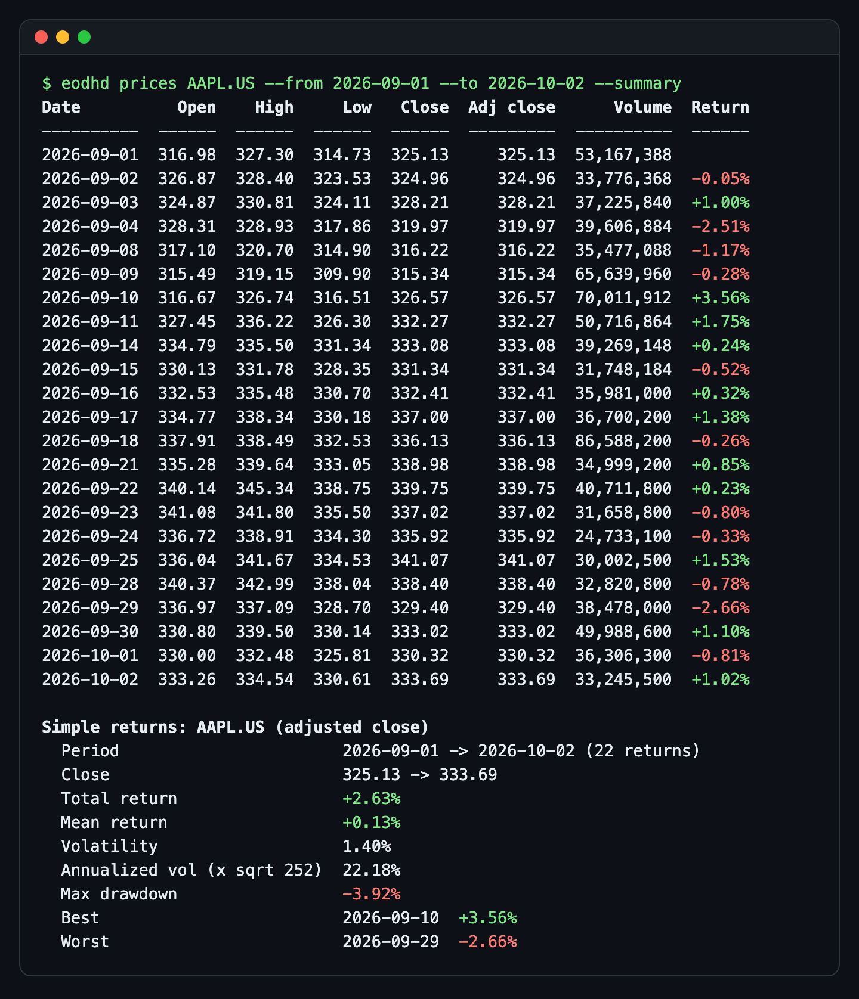
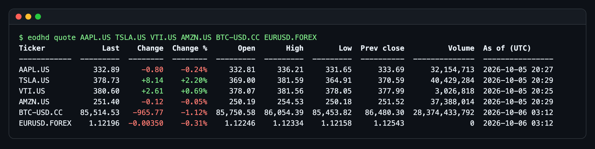
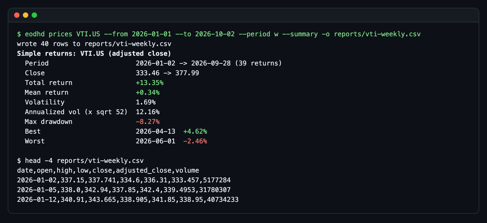

# eodhd-market-data-cli

[](https://github.com/jovanshernandez/eodhd-market-data-cli/actions/workflows/ci.yml)

`eodhd` is a small command line client for the [EODHD](https://eodhd.com/financial-apis/) market data API. It searches instruments across stocks, ETFs, funds, indices and crypto, pulls end-of-day OHLCV history for any ticker and date range, shows delayed quotes, and summarizes a price series as simple returns: total return, volatility, annualized volatility and max drawdown. The interesting part is the plumbing a market data job needs before it can be trusted unattended: bounded retries with backoff on rate limits and server errors, timeouts, clear failure messages, an API key that never ends up in output or logs, and clean CSV/JSON on stdout so it composes with other tools.







All three screenshots are real runs against the public `demo` key.

## Features

- `eodhd search` finds instruments by name, ticker or ISIN, filtered by asset type and exchange.
- `eodhd prices` fetches daily, weekly or monthly OHLCV bars for a date range, with per-bar returns.
- `--summary` adds total return, mean return, volatility, annualized volatility, max drawdown, best and worst bar.
- `eodhd quote` fetches the latest delayed quote for several tickers in one request.
- Output as an aligned table (colored when stdout is a terminal), CSV or JSON, to stdout or a file.
- Retries with exponential backoff and jitter on HTTP 429/5xx and network errors; honors `Retry-After`.
- 401/403/404 fail fast with a message that says what to check.
- API key from `EODHD_API_KEY`; it is redacted from every error message and never printed.
- One runtime dependency (`requests`). Tests run fully offline.

## Quick start

```bash
git clone https://github.com/jovanshernandez/eodhd-market-data-cli.git
cd eodhd-market-data-cli
python3 -m venv .venv
source .venv/bin/activate
pip install -e ".[dev]"
```

EODHD publishes a `demo` key, so you can try it without signing up:

```bash
export EODHD_API_KEY=demo

eodhd quote AAPL.US TSLA.US BTC-USD.CC EURUSD.FOREX
eodhd prices AAPL.US --from 2026-09-01 --to 2026-10-02 --summary
eodhd prices BTC-USD.CC --days 7 --format json --summary
eodhd prices VTI.US --from 2026-01-01 --period w --summary -o reports/vti-weekly.csv
```

The demo key covers prices and quotes for `AAPL.US`, `TSLA.US`, `VTI.US`, `AMZN.US`, `BTC-USD.CC` and `EURUSD.FOREX`. It does not cover search; with the demo key, `eodhd search` returns a 403 and the CLI says so. With your own key (free tier at eodhd.com):

```bash
export EODHD_API_KEY=your_key

eodhd search "vanguard total" --type etf
eodhd search apple --exchange US --format csv -o reports/apple.csv
```

Tickers use EODHD's `SYMBOL.EXCHANGE` form: `AAPL.US`, `VOD.LSE`, `BTC-USD.CC`, `EURUSD.FOREX`. Run `eodhd <command> --help` for every option.

Exit codes: `0` success, `1` API or data error, `2` usage error (bad flag, bad date, missing key).

## How it works

**Endpoints.** `search` calls `/api/search/{query}`, `prices` calls `/api/eod/{ticker}?from=&to=&period=`, and `quote` calls `/api/real-time/{ticker}?s=` with extra tickers batched into one request. Responses are parsed into frozen dataclasses (`SearchResult`, `Bar`, `Quote`) before anything is rendered.

**Retries.** Only failures that can succeed on a second try are retried: 429 (rate limited), 500/502/503/504, connection errors and timeouts. The wait doubles each attempt (0.5s, 1s, 2s, capped at 8s) and is jittered to 50-100% of that so parallel jobs don't retry in lockstep. A `Retry-After` header from the server wins over the computed delay. Each retry is reported on stderr. Everything else (401 bad key, 403 not in plan, 404 bad ticker) fails on the first response, since retrying would only burn quota.

**Secrets.** The key goes in the `api_token` query parameter, which means `requests` exceptions can carry the full URL. Every error is passed through a redactor before it reaches the user, and the client's `repr` hides the key.

**Returns.** A simple return is `P_t / P_(t-1) - 1`, computed on the adjusted close so splits and dividends don't show up as price moves. Volatility is the sample standard deviation of those returns; annualized volatility scales it by the square root of periods per year: 252 for daily equity/FX bars, 365 for daily crypto (it trades every day), 52 for weekly, 12 for monthly. Max drawdown is the largest peak-to-trough fall in the adjusted close over the window.

**Output.** Tables go to stdout. With `--format csv|json`, stdout carries only data, so `eodhd prices AAPL.US --format csv > aapl.csv` is safe; a CSV `--summary` goes to stderr, and a JSON `--summary` becomes one document with `ticker`, `bars` and `summary`. `-o` picks CSV or JSON from the file suffix.

## Testing

```bash
pytest -q
```

The suite replaces the HTTP session with a fake that replays queued responses, and an autouse fixture fails any test that tries to reach the network. It covers request building and parsing for all three endpoints, retry on 429 with `Retry-After`, exponential backoff and its cap on 5xx, retry on connection errors and timeouts, fail-fast on 4xx, key redaction, the returns math, and the CLI's table, CSV, JSON and file output. CI runs the suite on Python 3.12 for every push and pull request.

## Project layout

```text
eodhd_market_data/
  cli.py        argparse subcommands, output routing, exit codes
  client.py     EodhdClient: endpoints, retry/backoff, error mapping, key redaction
  models.py     SearchResult, Bar, Quote dataclasses parsed from API JSON
  analytics.py  simple returns, volatility, annualization, max drawdown
  output.py     terminal tables, colors, CSV and JSON rendering
tests/
  conftest.py   fake HTTP session and network guard
  test_client.py
  test_analytics.py
  test_cli.py
docs/images/    README screenshots
```
